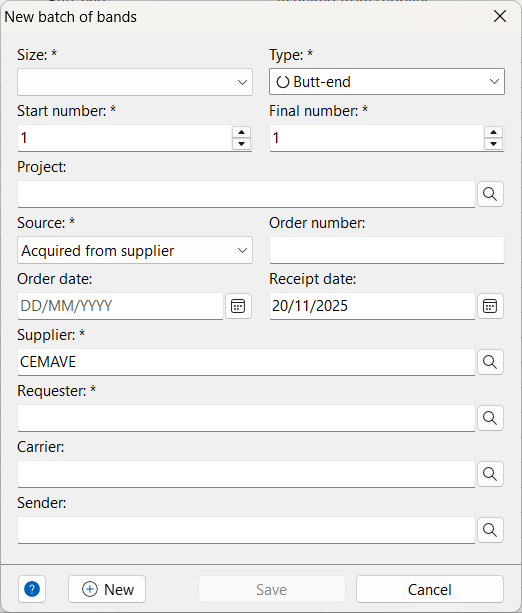
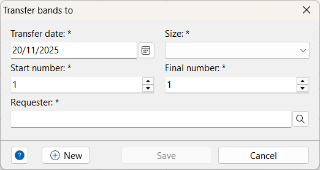
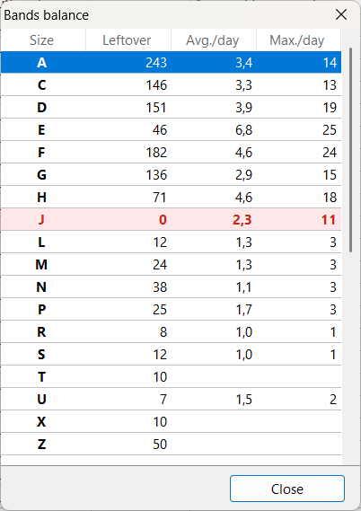

# Bands (Rings)

Bird bands (or rings) are a standardized method to identify individual birds in the field. Each band is engraved with a **unique identifier code**, allowing researchers to track movements, survival, and other biological data over time.

Xolmis is prepared to work with the **[Brazilian National Banding System](https://www.gov.br/icmbio/pt-br/assuntos/centros-de-pesquisa/aves-silvestres/destaques/sistema-nacional-anilhamento)** (SNA – *Sistema Nacional de Anilhamento*), where each band is engraved with:

- A **size code** (a letter indicating the band size), and
- A **unique sequential number** for that size.

!!! info
    The **Brazilian National Banding System** (SNA – *Sistema Nacional de Anilhamento*) is the official program responsible for regulating and coordinating bird banding activities in Brazil. It is managed by [CEMAVE](https://www.gov.br/icmbio/pt-br/assuntos/centros-de-pesquisa/aves-silvestres) – the National Center for Research and Conservation of Wild Birds (*Centro Nacional de Pesquisa e Conservação de Aves Silvestres*). CEMAVE operates under [ICMBio](https://www.gov.br/icmbio) – the Chico Mendes Institute for Biodiversity Conservation (*Instituto Chico Mendes de Conservação da Biodiversidade*), which is a federal autarchy linked to the [MMA](https://www.gov.br/mma) – Ministry of Environment and Climate Change (*Ministério do Meio Ambiente e Mudança do Clima*).  
    
    The roles of SNA are:

    - **Coordination**: Oversees all bird banding activities across the country, ensuring standardized methods and data collection.  
    - **Authorization**: Issues permits for researchers and institutions to capture, band, and study wild birds.  
    - **Database management**: Maintains the national repository of banding records, supporting scientific research and conservation policies.  
    - **Integration**: Connects local projects with national and international initiatives, contributing to global knowledge on bird migration and ecology.  

    The SNA is essential for:  

    - Monitoring bird populations and migration routes.  
    - Supporting conservation strategies for threatened species.  
    - Providing reliable data for ecological and environmental research.  
    - Ensuring that banding activities follow ethical and legal standards.  

!!! note
    We plan to include support for other national and international banding systems.
    Contributors familiar with these systems are welcome to collaborate. Contact us if you are interested.

Open the Bands module in the main menu: **Management → Bands**.

## Adding or editing bands

When creating or editing a band record, the following fields are available:

| Field | Required | Description |
| --- | --- | --- |
| **Size** | Yes | Band size according to CEMAVE standard (Brazil) |
| **Number** | Yes | Unique sequential number for the band |
| **Prefix** |  | Optional prefix for the band code |
| **Suffix** |  | Optional suffix for the band code |
| **Type** | Yes | Type of band (metal, plastic, color, etc.) |
| **Color** |  | Band color (especially for plastic/color bands) |
| **Status** | Yes | Current status or fate of the band (available, used, lost, destroyed) |
| **Reported** |  | Check if the band’s fate has already been reported to the national system |
| **Source** | Yes | How the band was obtained or retrieved |
| **Supplier** | Yes | Supplier or institution that provided the band |
| **Requester** | Yes | Person or institution that requested the band |
| **Carrier** |  | Person currently holding the band |
| **Project** |  | Project to which the band is linked |
| **Notes** |  | Any additional information about the band |

## Adding a new batch

The **New batch** dialog allows you to add multiple bands at once, sharing common attributes such as size, type, source, and supplier. Every number from the **Start number** to the **Final number** will be added as an individual band record.

| Field | Required | Description |
| --- | --- | --- |
| **Size** | Yes | Band size code for the batch |
| **Type** | Yes | Type of band |
| **Start number** | Yes | First band number in the sequence |
| **Final number** | Yes | Last band number in the sequence |
| **Project** |  | Project to which the batch is linked |
| **Source** | Yes | How the batch was obtained |
| **Order number** |  | Protocol or order number for the batch |
| **Order date** |  | Date when the batch was ordered |
| **Receipt date** |  | Date when the batch was received |
| **Supplier** | Yes | Supplier of the batch |
| **Requester** | Yes | Person or institution that requested the batch |
| **Carrier** |  | Person who will keep the bands |
| **Sender** |  | Person who transferred the batch |

## Transferring bands

To transfer a batch of bands to another bander:

1. Click the **More options** button :material-dots-horizontal:.  
2. Fill in the transfer dialog:

| Field | Required | Description |
| --- | --- | --- |
| **Transfer date** | Yes | Date of the transfer |
| **Size** | Yes | Band size code of the batch |
| **Start number** | Yes | First band number in the sequence |
| **Final number** | Yes | Last band number in the sequence |
| **Requester** | Yes | Bander to whom the bands will be transferred |

Click **Save** to record the transfer for each band number. To view transfer records, open the **band history** of each transferred band.

## Band history

The **Band history** dialog displays all transactions for a specific band, including:

- Ordered  
- Received  
- Transferred  
- Used (banded an individual)  
- Lost
- Broken  

This ensures traceability and compliance with national banding systems.

## Bands balance

The **Bands balance** view shows:

- The quantity of bands available for each size  
- The average number of bands used per day  
- The maximum number of bands used in a single day  

These indicators help predict when to reorder bands:

- Rows highlighted in **yellow** indicate low stock.  
- Rows in **red** indicate that all bands of a particular size have been used.

Right-click on the list to access the popup menu:

- **Refresh** or press ++f5++ to update values  
- **Export CSV** to save the list as a CSV file  
- **Print** to generate a report (printable or exportable as PDF)

## Best practices

- **Always record transfers** to maintain traceability.  
- **Report band usage and losses** promptly to comply with national systems.  
- **Use projects** to organize bands by research activity.  
- **Keep balance updated** to avoid running out of bands during fieldwork.  
- **Check band history** before reusing or reallocating bands.  

## Relation to other modules

Bands are directly linked to:

- **[Individuals](individuals.md)**: each used band is associated with a bird record.  
- **[Captures](captures.md)**: each capture is associated with a band.
- **[Projects](projects.md)**: bands can be tied to specific research projects.  
- **[Institutions](institutions.md) and [researchers](researchers.md)**: suppliers, requesters, and carriers are linked to registered institutions and people.  

This integration ensures that banding data is consistent across the database and supports long-term monitoring of bird populations.

*[CSV]: Comma-Separated Values
