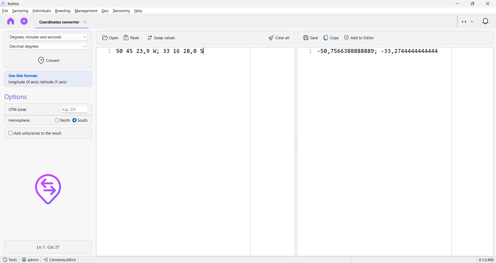

# Coordinates converter

Xolmis have a tool to convert geographical coordinates (only WGS84). It is accessible in the top menu **Geo → Coordinates converter**. It will open in a new tab.

!!! warning "Important"

    The coordinates need to be informed in the following order and separated by `;` (semicolon): **longitude**; **latitude**.

    Inserting the coordinates in the wrong order will lead to incorrect converted coordinates.

## Options

In the top of the left panel, select the source format and the format to convert to, respectively. The coordinate formats available are:

- Decimal degrees
- Degrees, minutes, and seconds (DMS)
- UTM

UTM format have additional required options to set:

- UTM zone
- Hemisphere

Converting to DMS or UTM, if you want the converted coordinates to have the DMS symbols or UTM zone, just check the option **Add units/zone to the result**.

## Getting coordinates to convert

### From file

You can open from file the coordinates to convert. The file must contain only longitude and latitude separated by semicolon.

### From clipboard

Copy the coordinates from another application (_e.g._ Microsoft Excel). Then you can paste the coordinates using the **Paste** button or the shortcut ++ctrl+v++ on the left text editor.

After the coordinates are loaded, coordinates are striped from symbols, and the format is guessed automatically.

### Swap values

The longitude and latitude separated by semicolon, must respect this sequence. But in case the values are presented as latitude and longitude, you can click the **Swap values** button to swap latitude and longitude values.

## Convert coordinates

If everything is correct, just click the **Convert** button. The converted coordinates will appear in the right text editor.

Errors will be indicated in the right text editor with the line number on the left editor. After correcting the coordinates with errors, just convert it again.

## After conversion

### Save to file

You can save the converted coordinates to a CSV file. Just click the **Save** button and inform a filename.

### Copy to clipboard

Click the **Copy** button to copy all converted coordinates to clipboard, then paste them where you want, even other applications.

### Add to GeoAssist

This option will add the converted coordinates to the [GeoAssist](adding-and-editing-data.md#geoassist) and will be available to use within Xolmis.

## Reset the converter

Click the **Clear all** button to clear the text editors and start anew.
