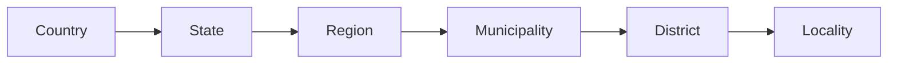

# Gazetteer

The **Gazetteer** is a catalog of toponyms (geographical names or known sites). Toponyms are a fundamental part of Xolmis because they are referenced in many other modules.

Once added to the Gazetteer, a toponym can be searched and selected to fill fields in related modules such as sightings, sampling plots, nests, or specimens.

You can access the Gazetteer from the main menu: **Geo → Gazetteer**.

## Hierarchy of toponyms

Toponyms in Xolmis follow a hierarchical structure, defined by their type and their parent toponym. This hierarchy ensures that sites are organized consistently and can be grouped or filtered correctly.

!!! example
    A locality such as *Parque Nacional Aparados da Serra* would be linked to the municipality *Cambará do Sul*, which belongs to the state *Rio Grande do Sul*, within the country *Brazil*.

## Adding and editing toponyms

When creating or editing a toponym, the following fields are available:

| Field | Required | Description |
| --- | --- | --- |
| **Name** | Yes | Official site name |
| **Abbreviation** |  | Abbreviation or short code, if applicable |
| **Type** | Yes | Type of toponym: country, state, region, municipality, district, locality |
| **Longitude** |  | Longitude coordinate (X axis), in decimal degrees |
| **Latitude** |  | Latitude coordinate (Y axis), in decimal degrees |
| **Altitude** |  | Elevation above sea level, in meters |
| **Parent toponym** |  | Parent site in the hierarchy (e.g., a municipality belongs to a region) |
| **Full name** | Yes | Complete hierarchical name (automatically generated once parent is defined) |
| **Site name on eBird** |  | Equivalent site name on eBird, used for data import |

!!! info "Site hierarchy"
    The hierarchy is used to display site names grouped like a tree, for example in [Quick filters](search-and-filtering-data.md#quick-filters). It is essential to assign the correct **Parent toponym** for each entry, otherwise the structure will be inconsistent and filters may not work properly.

### Semi-automatic addition of toponyms

The **Gazetteer** is the geographical database of Xolmis, responsible for organizing localities in a hierarchical structure (country → state/province → municipality → specific locality). To streamline the process of filling in data, the system provides tools for **semi-automatic addition of toponyms**, avoiding the need for users to manually register each item.

These tools allow importing complete lists of countries, states, and municipalities directly into the database, ensuring consistency and saving time.

#### How to add countries and states

In the **More options** button :material-dots-horizontal:, select **Add countries and states**.  
A dialog will open with the list of available countries. By selecting a country, you can also choose to include all of its states or provinces.  

- It is possible to select multiple countries at once.  
- States are automatically added and linked to their respective country.  
- After confirming the selection, click **Apply** so the records are created in the Gazetteer.  

#### How to add municipalities

When selecting a state already present in the Gazetteer, the option **Add municipalities** becomes available in the **More options** button :material-dots-horizontal:.  
This tool opens a list with all municipalities of the chosen state, allowing you to select as many as you wish.  

- Municipalities are added hierarchically, linked to the corresponding state.  
- You can select all municipalities of a state or only specific ones.  
- After making your selection, click **Apply** to complete the import.  

#### Benefits of semi-automatic addition

- **Speed**: hundreds of toponyms can be added in just a few clicks.  
- **Consistency**: names follow official standards, reducing typing errors.  
- **Automatic hierarchy**: countries, states, and municipalities are correctly organized within the Gazetteer structure.  
- **Integration**: added toponyms are immediately available for use in other Xolmis modules.  

## Tips and best practices

- **Start broad, then refine**: always begin by adding countries, then states/provinces, and only afterwards municipalities and localities.  
- **Use official names**: prefer standardized names (ISO or government sources) to avoid duplicates.  
- **Coordinates help**: adding latitude/longitude makes it easier to integrate with maps and spatial queries.  
- **Import helper**: Xolmis provides a helper tool to automatically add countries and their states/provinces. You select the countries you need, and the system fills them into the Gazetteer. After that, you only need to add municipalities and specific localities.  
- **Consistency matters**: once a toponym is created, it will be reused across modules. Take care to define it correctly to avoid errors later.

## Relation to other modules

The Gazetteer is not an isolated catalog. It is directly linked to:

- **[Sampling plots](sampling-plots.md)**: each plot must be tied to a locality or higher-level toponym.  
- **[Sightings](sightings.md) and [specimens](specimens.md)**: all records reference a site from the Gazetteer.  
- **[Captures](captures.md)**: associated with specific localities.  

Because of these dependencies, filling the Gazetteer correctly is one of the first steps when [starting a new database](first-steps.md).
