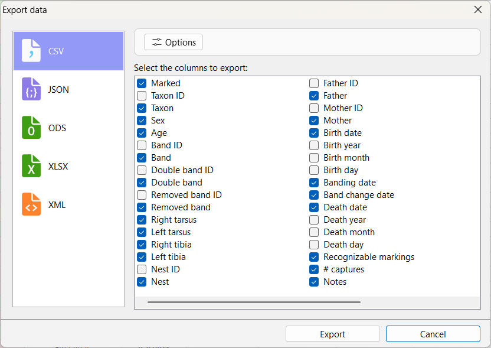

# Exporting data

One of the main goals of **Xolmis** is to serve as a reliable **data repository**, where information can be stored, organized, and later transferred for use in other applications. Exporting data allows you to share results, perform external analyses, or integrate Xolmis records with other software tools such as spreadsheets, statistical packages, or GIS systems.

!!! note
      To export data, the **user must have permission** for that. See details in [Users](users.md).

## Quick export

The **Quick export** feature is designed to make exporting data fast and flexible. To use it, first [search and filter](search-and-filtering-data.md) the data according to your needs. Once the dataset is ready, click on the **share** :fontawesome-solid-share-square: button. This will open the export dialog:

### Choosing the format

On the left panel of the dialog, select the file format to which you want to export. Xolmis supports multiple formats, such as:

- **CSV** – Ideal for spreadsheets and statistical software.
- **JSON** – Useful for structured data exchange and integration with APIs.
- **ODS and XLSX** - Spreadsheet documents, alternatives to CSV files.
- **XML** – Suitable for interoperability with legacy systems.

### Configuring options

If the selected format has configurable options, click the **Options** button to adjust them. For example, the CSV options dialog allows you to define:

- **Delimiter** (comma, semicolon, tab, etc.)  
- **Text encoding** (UTF-8 recommended for international compatibility)  
- **Decimal separator** (dot or comma)  
- **Include headers** (whether to export column names)  

### Selecting columns

After configuring the format, select the **columns** you want to export. This step ensures that only relevant data is included in the output file, reducing file size and simplifying analysis.

### Finalizing the export

When everything is ready, click the **Export** button. You will be prompted to choose a filename and location. The file will then be saved using the defined settings. The exported file can be opened in external applications for further processing, visualization, or sharing.

!!! tip
    In [Settings](settings.md), enable **Open files after export** to automatically open the exported file with your system’s default application immediately after it is saved.

## Best practices

- **Filter before exporting**: Use [search and filters](search-and-filtering-data.md) to reduce the dataset to only what you need.  
- **Choose the right format**: Select CSV for spreadsheets, JSON for structured data, and XML for interoperability.  
- **Check encoding**: Always use UTF-8 when working with international datasets to avoid character issues.  
- **Document exports**: Keep track of exported files, especially when sharing with collaborators.  
- **Use column selection**: Export only the necessary fields to simplify downstream analysis.  

## Relation to other modules

Exporting data is available across multiple modules in Xolmis.  

By using the export feature, you ensure that data collected and managed in Xolmis can be easily integrated into broader research workflows.

*[CSV]: Comma Separated Values
*[JSON]: JavaScript Object Notation
*[ODS]: Open Document Spreadsheet
*[XLSX]: Microsoft Excel spreadsheet
*[XML]: Extensible Markup Language
