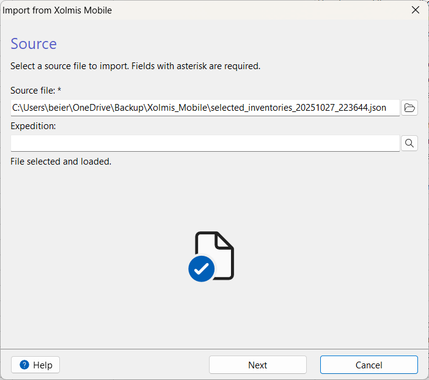
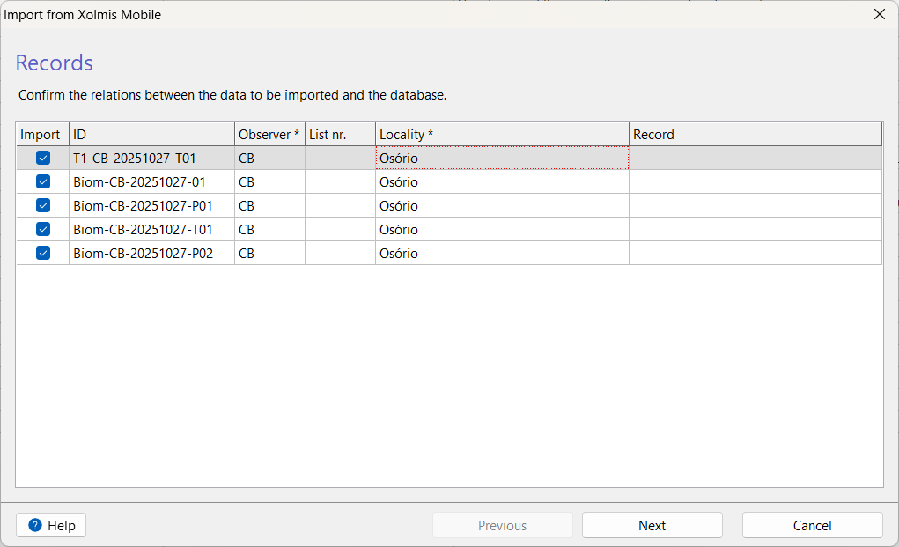
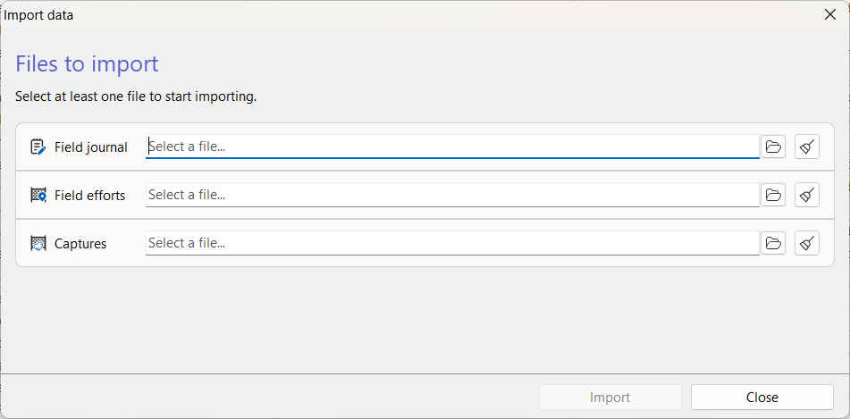
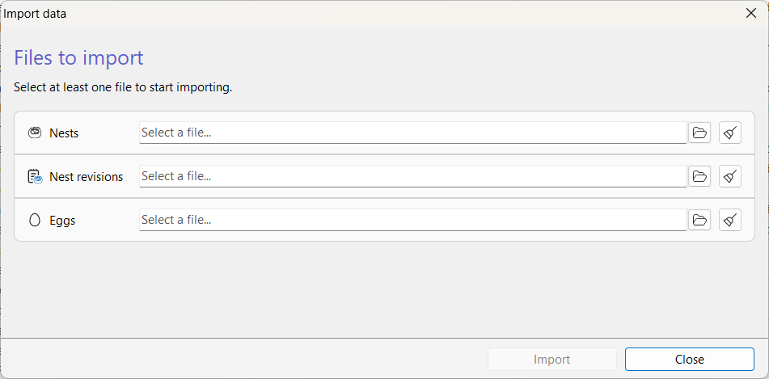

# Importing data

Xolmis is designed to be a **flexible data repository**, capable of integrating information collected from different sources and formats. Importing data allows you to bring external records into the system, whether they come from fieldwork, other platforms, or geographic tools. There are several methods to import files into Xolmis, depending on the file’s origin and format. Each option is outlined below.

!!! note
      To import data, the **user must have permission** for that. See details in [Users](users.md).

## Import wizard

The **Import wizard** is a general tool that guides the user step by step through the import process. It is designed to validate data before insertion, ensuring consistency and reliability across the system. Future updates will include support for bulk imports, advanced error handling, and mapping of fields between external files and Xolmis tables.

### Supported file formats

Xolmis currently supports importing data from multiple file types, each suited to different use cases:

- **CSV (Comma-Separated Values)**
      - Widely used for tabular data.
      - Compatible with most spreadsheet and statistical software.
      - Simple and lightweight, but does not support complex structures.
- **TSV (Tab-Separated Values)**
      - Similar to CSV, but uses tabs as delimiters.
      - Useful when data fields contain commas, reducing parsing errors.
- **JSON (JavaScript Object Notation)**
      - Ideal for structured data exchange and integration with APIs.
      - Human-readable and machine-friendly.
      - Supports hierarchical data.
- **XML (eXtensible Markup Language)**
      - Suitable for interoperability with legacy systems.
      - Schema-based validation possible.
      - Verbose but standardized.
- **ODS (OpenDocument Spreadsheet)**
      - Open standard for spreadsheet documents.
      - Preserves formatting, formulas, and multiple sheets.
      - Good alternative to proprietary formats.
- **XLSX (Microsoft Excel)**
      - Native format for Microsoft Excel.
      - Supports rich spreadsheet features such as styles, formulas, and multiple sheets.
      - Widely used in professional environments.
- **DBF (Database File)**
      - Legacy format used by dBASE and compatible applications.
      - Still common in some GIS and database workflows.
      - Useful for interoperability with older systems.

### Tips for choosing the right format

- Use **CSV/TSV** for simple tabular data and maximum compatibility.  
- Use **JSON/XML** for structured or hierarchical data, especially when integrating with other systems.  
- Use **ODS/XLSX** when spreadsheet features (formulas, formatting, multiple sheets) are required.  
- Use **DBF** if working with legacy databases or GIS applications that rely on this format.

## Xolmis Mobile

Xolmis has a mobile companion app, [Xolmis Mobile](xolmis-mobile.md), which enables the collection of data directly in the field. Data collected with the app can be exported as text files in **JSON** format, ready to be imported into the desktop version of Xolmis.

 

To import JSON files from Xolmis Mobile:

1. Open the import wizard in the main menu: **File → Import → Xolmis mobile**.  
2. In the dialog, choose the source file. The system will automatically validate the file and indicate whether it is acceptable. Optionally, you can select an **expedition** to associate with the imported data.
3. Click **Next** to proceed. The records from the file will be listed.  
      - You can uncheck records you do not want to import.  
      - Some fields may be filled automatically if matching data already exists.  
      - **Observer** and **Locality** are required fields.  
      - The **Record** column corresponds to the database record for each file entry.  
4. Click **Next** again to start the import.  
      - Records without a corresponding database entry will be inserted.  
      - Records with a match will be updated.  
5. The progress will be displayed in the dialog. You can stop the process at any time by clicking **Cancel**.  
6. When finished, the dialog will show the result.  
      - If errors occurred, no data will be saved.  
      - You can retry with **Try Again** or save the import log with **Save Log** to investigate issues.

## eBird records

Xolmis supports importing data exported from the **eBird** platform in **CSV** format. To import eBird records:

1. Select **File → Import → eBird records**.  
2. Locate and select the desired file.  
3. The import process will begin automatically, and a message will confirm completion.  

This feature allows you to integrate citizen science data with your own research database.

## Banding data

Banding data can be imported in **CSV** format.  
Each CSV file must follow a **predefined schema** to ensure that the data can be validated and correctly integrated into the system.

### How to import

1. Select **File → Import → Banding Data**.  
2. The dialog will open, allowing you to choose one or more files for **Field journal**, **Field efforts**, and **Captures**.  
   - There are **three types of banding data** available for import.  
   - You must select at least one file, but you may select all three.  
3. Once the import begins, the dialog will display progress and results.

This feature ensures that banding records collected externally can be integrated into the **Surveys**, **Net efforts**, **Individuals**, and **Captures** modules.

### CSV Schemas

Below are the outlines of the three CSV schemas.

#### 1. Field journal schema

| Column | Description |
| --- | --- |
| **LOCALITY** | study site name |
| **NET STATION** | banding station name |
| **SAMPLING DATE** | date of fieldwork |
| **START TIME** | time when the first net was opened |
| **END TIME** | time when the last net was closed |
| **LONGITUDE** | in decimal degrees |
| **LATITUDE** | in decimal degrees |
| **TEAM** | abbreviations of researchers comma-separated |
| **NOTES** | any observations or additional information |

#### 2. Field efforts schema

| Column | Description |
| --- | --- |
| **LOCALITY** | study site name |
| **NET STATION** | banding station name |
| **SAMPLING DATE** | date of effort |
| **NET NUMBER** | number of the mist net in the field |
| **LONGITUDE** | in decimal degrees |
| **LATITUDE** | in decimal degrees |
| **OPEN TIME 1** | time when the net was opened the first time |
| **CLOSE TIME 1** | time when the net was closed the first time |
| **OPEN TIME 2** | time when the net was opened the second time |
| **CLOSE TIME 2** | time when the net was closed the second time |
| **OPEN TIME 3** | time when the net was opened the third time |
| **CLOSE TIME 3** | time when the net was closed the third time |
| **OPEN TIME 4** | time when the net was opened the fourth time |
| **CLOSE TIME 4** | time when the net was closed the fourth time |
| **NOTES** | any additional information about the net |

#### 3. Captures schema

| Column | Description |
| --- | --- |
| **LOCALITY** | study site name |
| **STATION** | banding station name |
| **DATA** | banding date |
| **RECORDER** | abbreviation of researcher which was writing down the data |
| **BANDER** | person responsible for banding |
| **CAP TIME** | time of capture |
| **NET SITE NAME** | net number or name |
| **NEW_RECAP** | nature of capture (new capture, recapture, same day, etc.) |
| **BAND_CODE** | alphabetic code of band size (one letter) |
| **BAND NUMBER** | unique band number for the band size |
| **RIGHT LEG** | bands combination in the right leg |
| **LEFT LEG** | bands combination in the left leg |
| **SPECIES NAME** | scientific name |
| **CP** | cloacal protuberance code |
| **BP** | brood patch code |
| **FAT** | subcutaneous fat code |
| **BODY MOLT** | body molt code |
| **FF MOLT** | flight feathers molt code |
| **FF WEAR** | flight feathers wear code |
| **RIGHT WING** | length of right wing chord, in millimeters |
| **FIRST SECONDARY** | length of right wing first secondary chord, in millimeters |
| **TAIL** | length of tail, in millimeters |
| **TARSUS LENGTH** | in millimeters |
| **RIGHT TARSUS DIAMETER** | in millimeters |
| **WEIGHT** | in grams |
| **MOLT LIMITS** | codes for each molt limit |
| **SKULL** | skull ossification code |
| **CYCLE CODE** | molt cycle code |
| **HOW AGED** | code of how the bird was aged |
| **SEX** | sex code |
| **HOW SEXED** | code of how the bird was sexed |
| **STATUS** | status code of the bird at release |
| **ESCAPED** | if the bird escaped without completing the measurements |
| **NOTES** | any additional information about the bird |
| **REMOVED BAND** | code and number of the removed band if it was replaced |
| **PHOTOGRAPHER** | slash-separated abbreviations of researchers that photographed the bird |
| **INITIAL PHOTO NUMBER** | number of the first photo filename for this bird |
| **FINAL PHOTO NUMBER** | number of the last photo filename for this bird |
| **CAMERA NAME** | identification of the camera used |
| **PHOTO NAME FORMULA** | standardized filename to rename photo files |
| **CRANIO** | length of skull, in millimeters |
| **CULMEN EXPOSTO** | length of exposed culmen, in millimeters |
| **NP** | distance of nostril to bill tip, in millimeters |
| **LARGURA BICO** | bill width, in millimeters |
| **ALTURA BICO** | bill height, in millimeters |
| **SANGUE** | if a blood sample was collected |
| **PENAS** | if a feather sample was collected |
| **LONGITUDE** | in decimal degrees |
| **LATITUDE** | in decimal degrees |
| **KIPPS** | Kipp's distance, in millimeters |
| **GLICOSE** | glucose measurement |
| **HEMOGLOBINA** | hemoglobin measurement |
| **HEMATOCRITO** | hematocrit measurement |
| **GPS NUMBER** | number of the GPS tracking device |

## Nests data

The import of **nest data** is under development. Future versions will allow importing nest records from external sources, linking them to individuals, localities, and projects.

## Geographical coordinates

Files containing geographical coordinates can be imported and used across various tables in Xolmis via the [GeoAssist](adding-and-editing-data.md#geoassist). This allows you to integrate spatial information directly into your ornithological records.

### Supported file formats

Xolmis currently supports the following formats:

- **CSV (Comma-Separated Values)**  
  Tabular format where latitude and longitude are stored in columns.  
  Best for simple datasets exported from spreadsheets or statistical software.

- **KML/KMZ (Keyhole Markup Language / Compressed KML)**  
  Widely used in Google Earth and other GIS tools.  
  Supports points, lines, polygons, and metadata.  
  KMZ is the compressed version of KML, useful for larger datasets.

- **GPX (GPS Exchange Format)**  
  Standard format for GPS devices and applications.  
  Ideal for importing tracks, routes, and waypoints recorded in the field.

- **GeoJSON**  
  Modern, lightweight format for representing geographical features in JSON.  
  Well-suited for web applications and APIs.  
  Supports complex geometries and properties.

### How to import

1. Select **File → Import → Geographical Coordinates**.  
2. Choose the file you wish to import.  
3. The system will process the file, validate the data, display progress, and notify you upon completion.

### Typical use cases

- Importing **GPS tracks** from field expeditions.  
- Adding **waypoints** for sampling plots or observation sites.  
- Loading **predefined polygons** for study areas or conservation zones.  
- Integrating **spatial datasets** from external GIS or mapping tools.

## Best practices

- **Validate files before importing**: Ensure that the format and structure match the expected requirements.
- **Keep backups**: Always maintain a copy of the original files before importing.
- **Use logs**: Save import logs when errors occur to diagnose problems.
- **Check duplicates**: Avoid importing the same file multiple times to prevent redundant records.
- **Prefer standardized formats**: Use CSV, JSON, KML, or GPX whenever possible for maximum compatibility.

## Relation to other modules

Imported data integrates seamlessly with other parts of Xolmis:

- **[Sightings](sightings.md), [Nests](nests.md) and [Specimens](specimens.md)**: Mobile data feed directly into sighting, nest and specimen records.  
- **[Surveys](surveys.md) and [Expeditions](expeditions.md)**: Imported coordinates and survey data enrich fieldwork records.  
- **[Reports](print-data.md) and [Exports](exporting-data.md)**: Once imported, data can be analyzed and exported again for external use.  

By using the import features, Xolmis becomes a central hub for managing ornithological data collected from diverse sources.

*[CSV]: Comma Separated Values
*[DBF]: Database File
*[GPX]: GPS Exchange Format
*[JSON]: JavaScript Object Notation
*[KML]: Keyhole Markup Language
*[KMZ]: Compressed Keyhole Markup Language
*[ODS]: Open Document Spreadsheet
*[TSV]: Tab Separated Values
*[XLSX]: Microsoft Excel spreadsheet
*[XML]: Extensible Markup Language
