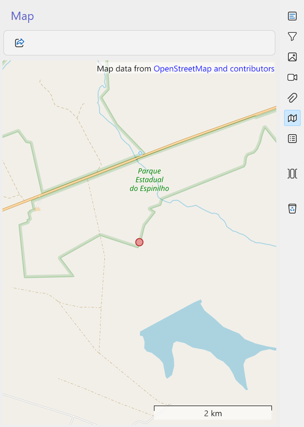

# Map

The **Map** feature allows you to visualize geographical coordinates stored in records. Modules that include location data (longitude and latitude) can display these points on an interactive map, helping researchers better understand the spatial distribution of records and their ecological context.

Open the map by clicking the **Map** button :material-map: in the right toolbar of the module.

## Navigating the map

The map provides basic interactive controls:

- **Zoom** – Use the mouse scroll wheel to zoom in and out.  
- **Pan** – Click, hold, and drag the mouse to move across the map.  
- **View records** – Dots represent the geographical coordinates of records.  

### Record visualization

- **Single record** – Generally, one **red dot** is shown, representing the coordinates of the current record.  
- **Surveys with mist nets**:
    - A **red dot** marks the survey start coordinates.  
    - **Yellow dots** mark the coordinates of each mist net.  

This visualization helps distinguish between general survey locations and specific sampling points.

## Exporting coordinates

At the top toolbar of the map, you can export the coordinates currently displayed by clicking the **share** button :material-share:. 

Supported export formats include:

- **KML** (default) – Compatible with Google Earth and other GIS tools.  
- **KMZ** – Compressed version of KML, useful for sharing multiple points.  
- **GPX** – Standard format for GPS devices and applications.  
- **GeoJSON** – Widely used format for web mapping and GIS applications.  

Exporting coordinates allows integration with external mapping tools, spatial analyses, and collaborative sharing.

## Best practices

- **Verify coordinates before exporting**: Ensure longitude and latitude values are accurate and consistent.  
- **Use appropriate precision**: Exact coordinates are ideal for detailed analyses, while reference coordinates may suffice for broader studies.  
- **Choose the right format**:  
    - Use **KML/KMZ** for visualization in Google Earth.  
    - Use **GPX** for GPS devices.  
    - Use **GeoJSON** for web-based GIS platforms.  
- **Document survey points**: When working with mist nets, always record both the survey start and individual net positions.  
- **Combine with metadata**: Exported coordinates are more useful when linked to taxa, observers, or project information.  

## Relation to other modules

The Map feature is integrated with several modules:

- **[Surveys](surveys.md)** – Visualize survey start points and mist net locations.  
- **[Sightings](sightings.md)** – Display observation coordinates.  
- **[Captures](captures.md)** – Show capture sites linked to individuals.  
- **[Nests](nests.md)** – Map breeding locations.  

By using the Map feature, researchers can explore spatial patterns, identify sampling coverage, and integrate Xolmis data with external GIS tools for advanced ecological analyses.

*[GIS]: Geographic Information System
*[GPX]: GPS Exchange Format
*[KML]: Keyhole Markup Language
*[KMZ]: Compressed Keyhole Markup Language
