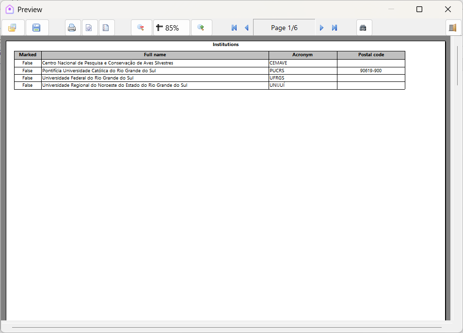
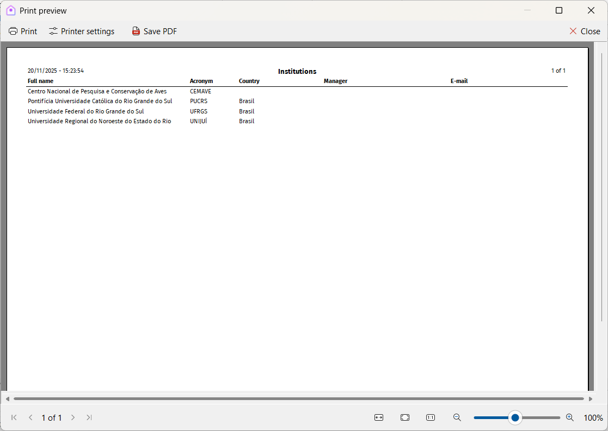

# Print data

Most modules in Xolmis include a **print button** :material-printer: that opens a menu with options to generate printable reports. This functionality allows researchers to produce hard copies or digital files (PDF) of their data, useful for documentation, sharing, or archiving.

!!! note
      To print data, the **user must have permission** for that. See details in [Users](users.md).

## Print grid

The **Print grid** option generates a report with the **exact same layout** as the module’s data grid. To use it:

1. Click the print button :material-printer: in the module toolbar.  
2. Select **Print grid**.  
3. A preview window will open, where you can send the report to the printer or save it to a file.  

!!! warning "Limitation"
    As many modules contain numerous columns, a single record may span multiple pages in the generated report. This can result in a large number of pages if the dataset is extensive.

## Print preview

Other reports use the **Xolmis print preview window**, which offers more flexibility and a standardized interface. Features include:

- **Zoom in/out** – Adjust the view of the report.  
- **Page navigation** – Move through pages using the controls in the bottom status bar.  
- **Toolbar options** – Send the report to the printer, configure printer settings, or save the report as PDF.  

### Send to printer

Click the **Print** button :material-printer: to send the report to a printer. This opens the print dialog, where you can:

- Select the printer to use.  
- Define which pages to print.  
- Set the number of copies.  

### Export PDF

Click the **Save PDF** button :fontawesome-regular-file-pdf: to export the report as a PDF file. This opens the save dialog, where you can:

- Choose the destination folder.  
- Define the file name.  

Exporting to PDF is recommended for sharing reports digitally or archiving them in project documentation.

## Best practices

- **Choose the right option**: Use *Print grid* for quick exports of raw data, and other options for more polished reports.  
- **Limit columns when possible**: Hide unnecessary columns before printing to reduce page count.  
- **Use PDF for sharing**: Export reports as PDF to ensure compatibility across devices and operating systems.  
- **Check printer settings**: Configure page size, orientation, and margins to avoid formatting issues.  
- **Archive reports**: Save important reports as PDF to maintain a permanent record of your data.  

## Relation to other modules

The print functionality is available across most modules, including:

- **[Sightings](sightings.md) and [Captures](captures.md)** – Generate reports of field observations and banding data.  
- **[Nests](nests.md) and [Eggs](eggs.md)** – Print breeding records for analysis or submission to institutions.  
- **[Projects](projects.md) and [Permits](permits.md)** – Produce administrative reports for management or compliance.  
- **[Institutions](institutions.md) and [Researchers](researchers.md)** – Export lists for collaboration or documentation.  

By using the print tools in Xolmis, researchers can easily transform digital records into **shareable, standardized reports**, supporting both scientific communication and administrative needs.
