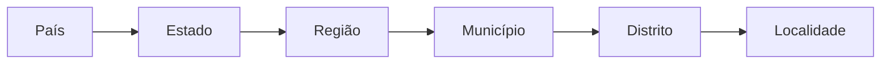

# Gazetteer

O **Gazetteer** é um catálogo de topônimos (nomes geográficos ou locais conhecidos). Os topônimos são uma parte fundamental do Xolmis porque são referenciados em muitos outros módulos.

Uma vez adicionados ao Gazetteer, os topônimos podem ser pesquisados e selecionados para preencher campos em módulos relacionados, como observações, parcelas de amostragem, ninhos ou espécimes.

Você pode acessar o Gazetteer a partir do menu principal: **Geo → Gazetteer**.

## Hierarquia de topônimos

Os topônimos no Xolmis seguem uma estrutura hierárquica, definida pelo seu tipo e pelo topônimo pai. Essa hierarquia garante que os locais sejam organizados de forma consistente e possam ser agrupados ou filtrados corretamente.

!!! example
    Uma localidade como *Parque Nacional Aparados da Serra* estaria vinculada ao município *Cambará do Sul*, que pertence ao estado *Rio Grande do Sul*, dentro do país *Brasil*.

## Adicionando e editando topônimos

Ao criar ou editar um topônimo, os seguintes campos estão disponíveis:

| Campo | Obrigatório | Descrição |
| --- | --- | --- |
| **Nome** | Sim | Nome oficial do local |
| **Abreviação** |  | Abreviação ou código curto, se aplicável |
| **Tipo** | Sim | Tipo de topônimo: país, estado, região, município, distrito, localidade |
| **Longitude** |  | Coordenada de longitude (eixo X), em graus decimais |
| **Latitude** |  | Coordenada de latitude (eixo Y), em graus decimais |
| **Altitude** |  | Elevação acima do nível do mar, em metros |
| **Topônimo pai** |  | Local pai na hierarquia (ex.: um município pertence a uma região) |
| **Nome completo** | Sim | Nome hierárquico completo (gerado automaticamente após definir o pai) |
| **Nome do local no eBird** |  | Nome equivalente no eBird, usado para importação de dados |

!!! info "Hierarquia de locais"
    A hierarquia é usada para exibir nomes de locais agrupados como uma árvore, por exemplo em [Filtros rápidos](search-and-filtering-data.md#filtros-rapidos). É essencial atribuir o **Topônimo pai** correto para cada entrada, caso contrário a estrutura ficará inconsistente e os filtros podem não funcionar adequadamente.

### Adição semiautomática de topônimos

O **Gazetteer** é a base geográfica do Xolmis, responsável por organizar localidades de forma hierárquica (país → estado/província → município → localidade específica). Para agilizar o processo de preenchimento, o sistema oferece ferramentas de **adição semiautomática de topônimos**, evitando que o usuário precise cadastrar manualmente cada item.

Essas ferramentas permitem importar listas completas de países, estados e municípios diretamente para o banco de dados, garantindo consistência e economia de tempo.

#### Como adicionar países e estados

No botão de **Mais opções** :material-dots-horizontal:, selecione **Adicionar países e estados**.  
Será aberto um diálogo com a lista de países disponíveis. Ao marcar um país, você pode optar por incluir também todos os seus estados ou províncias.  

- É possível selecionar múltiplos países de uma só vez.  
- Os estados são adicionados automaticamente vinculados ao respectivo país.  
- Após confirmar a seleção, clique em **Aplicar** para que os registros sejam criados no Gazetteer.  

#### Como adicionar municípios

Ao selecionar um estado já presente no Gazetteer, ficará disponível a opção **Adicionar municípios** no botão **Mais opções** :material-dots-horizontal:.  
Essa ferramenta abre uma lista com todos os municípios do estado escolhido, permitindo que você selecione quantos desejar.  

- Os municípios são adicionados hierarquicamente, vinculados ao estado correspondente.  
- É possível selecionar todos os municípios de um estado ou apenas alguns específicos.  
- Após a seleção, clique em **Aplicar** para concluir a importação.  

#### Benefícios da adição semiautomática

- **Rapidez**: centenas de topônimos podem ser adicionados em poucos cliques.  
- **Consistência**: os nomes seguem padrões oficiais, reduzindo erros de digitação.  
- **Hierarquia automática**: países, estados e municípios são organizados corretamente na estrutura do Gazetteer.  
- **Integração**: os topônimos adicionados ficam imediatamente disponíveis para uso em outros módulos do Xolmis.  

## Dicas e boas práticas

- **Comece amplo, depois refine**: sempre inicie adicionando países, depois estados/províncias e só então municípios e localidades.  
- **Use nomes oficiais**: prefira nomes padronizados (ISO ou fontes governamentais) para evitar duplicações.  
- **Coordenadas ajudam**: adicionar latitude/longitude facilita a integração com mapas e consultas espaciais.  
- **Ferramenta de importação**: o Xolmis fornece uma ferramenta auxiliar para adicionar automaticamente países e seus estados/províncias. Você seleciona os países necessários e o sistema os insere no Gazetteer. Depois disso, basta adicionar municípios e localidades específicas.  
- **Consistência importa**: uma vez criado, o topônimo será reutilizado em vários módulos. Defina-o corretamente para evitar erros futuros.  

## Relação com outros módulos

O Gazetteer não é um catálogo isolado. Ele está diretamente ligado a:

- **[Parcelas mostrais](sampling-plots.md)**: cada parcela deve estar vinculada a uma localidade ou topônimo de nível superior.  
- **[Observações](sightings.md) e [Espécimes](specimens.md)**: todos os registros fazem referência a um local do Gazetteer.  
- **[Capturas](captures.md)**: associadas a localidades específicas.  

Devido a essas dependências, preencher corretamente o Gazetteer é um dos primeiros passos ao [iniciando um novo banco de dados](first-steps.md).
