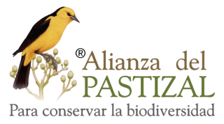

# Sponsors

The development and maintenance of **Xolmis** is made possible thanks to the generous support of our sponsors. Their contributions help ensure that the platform continues to evolve, providing reliable tools for research, data management, and conservation initiatives.

## Platinum Sponsor

The Platinum sponsor represents our highest level of partnership. It provides strategic and long-term support, enabling us to expand features, improve performance, and reach a wider community of users.

### Alianza del Pastizal

A regional initiative dedicated to the conservation of grassland ecosystems in South America. Their sponsorship strengthens Xolmis as a software for managing biodiversity data and supports collaborative efforts among institutions, researchers, and conservation projects. For more information: [Alianza del Pastizal Brasil](https://www.alianzadelpastizal.org.br/).
