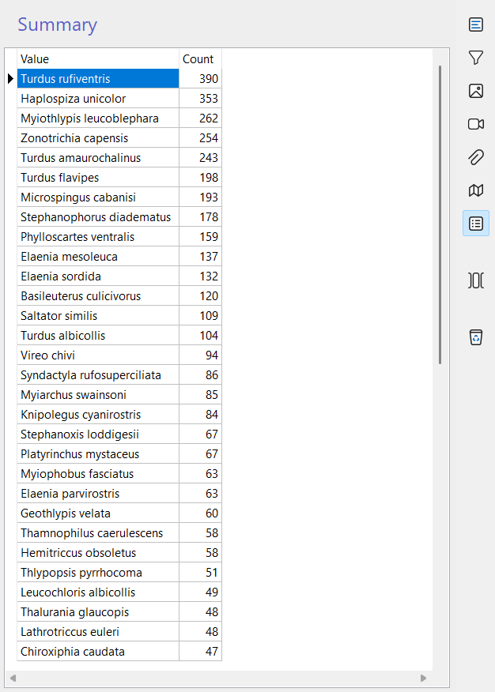

# Summary

The **Summary** feature provides quick calculations and statistics for the selected column in a data grid. It is designed to help researchers obtain an overview of their data without needing to export or process it externally. Summaries can include simple counts, averages, or other basic statistics depending on the type of column selected.

## How it works

- **Counts** – For categorical or text-based columns, the summary shows the total number of records.  
- **Averages** – For numerical measurement columns (e.g., length, mass, width), the summary calculates the average value.  
- **Grouped averages** – For measurement columns linked to taxa, the average value is calculated **per taxon**, allowing comparisons between species.  
- **Unsupported columns** – Some columns do not support summary calculations (e.g., notes, free text fields).  

!!! info "Current limitations"
    At the moment, the summary feature is very simple. It provides only basic counts and averages, without advanced statistical tools. We plan to improve and expand it in future versions, including more descriptive statistics and visualization options.

!!! note "Planned improvements"
    Future versions of the summary feature may include:

    - **Minimum and maximum values** – To quickly identify ranges in measurement data.  
    - **Standard deviation and variance** – To evaluate data dispersion.  
    - **Median and quartiles** – For more robust central tendency measures.  
    - **Frequency distributions** – To show how values are spread across categories.  
    - **Charts and graphs** – Visual summaries such as histograms or pie charts.  
    - **Export options** – Ability to save summaries as CSV or PDF for reporting.  

## Opening the summary

To open the summary:

1. Select the column you want to analyze in the data grid.  
2. Click the list icon :material-list-box-outline: in the right toolbar (if available).  
3. The summary panel will display the calculated values for the selected column.  

## Best practices

- **Use summaries for quick checks**: Ideal for validating data entry or spotting inconsistencies.  
- **Compare taxa averages**: Helps identify biological differences or potential outliers.  
- **Avoid relying solely on summaries**: For detailed statistical analysis, export data to specialized tools (e.g., R, Python, Excel).  
- **Check unsupported columns**: Remember that free-text fields and notes will not generate summaries.  

## Relation to other modules

The summary feature is available in most modules with tabular data, including:

- **[Captures](captures.md)** – Summarize measurements such as wing length, mass, or tarsus size.  
- **[Sightings](sightings.md)** – Count records per observer or per locality.  
- **[Nests](nests.md) and [Eggs](eggs.md)** – Calculate averages of egg dimensions or nest productivity.  

By using the summary tool, researchers gain a **quick, integrated overview of their dataset**, supporting quality control and preliminary analysis directly within Xolmis.
