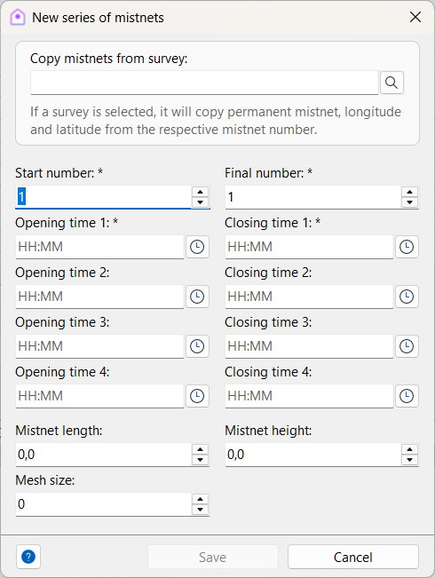

# Surveys

The **Surveys** module is used to record sampling events in the field. A survey represents a structured activity where researchers collect ornithological data using defined methods such as point counts, transects, mist nets, or opportunistic observations. Surveys are essential for organizing fieldwork, linking captures and observations to specific sampling contexts, and ensuring that data can be analyzed consistently.

Open the Surveys module in the main menu: **Fieldwork → Surveys**.

## Adding or editing a survey

When creating or editing a survey record, the following fields are available:

| Field | Required | Description |
| --- | --- | --- |
| **Expedition** |  | Expedition to which the survey is linked |
| **Survey date** | Yes | Date of sampling |
| **Duration** |  | Duration of sampling, in minutes |
| **Starting time** |  | Time when the sampling started |
| **Ending time** |  | Time when the sampling ended |
| **Method** | Yes | Sampling method used (point count, transect, mist netting, etc.) |
| **Locality** | Yes | Locality where the sampling occurred (linked to Gazetteer) |
| **Mist net station** |  | Station used if the method was banding |
| **Project** |  | Project to which the survey is associated |
| **Longitude (initial)** |  | Initial longitude coordinate |
| **Latitude (initial)** |  | Initial latitude coordinate |
| **End longitude** |  | Ending longitude coordinate |
| **End latitude** |  | Ending latitude coordinate |
| **Number of observers** |  | Number of observers or banders participating |
| **Sample identifier** |  | Identifier for point, transect, list, etc. |
| **Area** |  | Total area sampled, in hectares |
| **Distance** |  | Total distance sampled, in kilometers |
| **Number of mist nets** |  | Total number of mist nets used |
| **Mist net effort** |  | Total capture effort using mist nets (calculated automatically) |
| **Environment description** |  | Brief description of the surroundings |
| **Mist net checking times** |  | Times of each mist net checking event |
| **Notes** |  | Any additional information about the survey |

## Survey members

Surveys often involve multiple participants. You can register both team members and visitors:

| Field | Required | Description |
| --- | --- | --- |
| **Researcher** | Yes | Person participating in the survey (from Researchers table) |
| **Visitor** |  | Indicates if the person is not part of the core team |

## Nets

Mist nets used during surveys can be recorded with detailed information:

| Field | Required | Description |
| --- | --- | --- |
| **Permanent net** |  | Reference to a permanent mist net with predefined coordinates |
| **Mist net number** | Yes | Identifier of the mist net |
| **Longitude** |  | Longitude coordinate of the net |
| **Latitude** |  | Latitude coordinate of the net |
| **Mist net length** |  | Length of the net, in meters |
| **Mist net height** |  | Height of the net, in meters |
| **Mesh size** |  | Mesh size, in millimeters |
| **Mist net area** |  | Total area of the net (calculated automatically) |
| **Survey date** | Yes | Date when the net was opened |
| **Total open time** |  | Total time the net was open (calculated automatically) |
| **Opening time 1–4** | Yes | Times when the net was opened |
| **Closing time 1–4** | Yes | Times when the net was closed |
| **Notes** |  | Any other information about the mist net |

### Adding nets in batches

The **Add nets in batches** dialog is designed to simplify the registration of mist net effort during surveys. Instead of adding each net one by one, you can define a range of nets (from a start number to an end number) and apply shared information to all of them at once. This speeds up data entry and ensures consistency across records.

| Field | Required | Description |
| --- | --- | --- |
| **Copy nets from survey** |  | If filled, permanent net data and longitude and latitude will be copied from the respective net number in the informed survey. |
| **Start number** | Yes | Identifier of the first mist net in the sequence. |
| **End number** | Yes | Identifier of the last mist net in the sequence. |
| **Opening time 1–4** | Yes | Times when the net was opened (up to four intervals). |
| **Closing time 1–4** | Yes | Times when the net was closed (up to four intervals). |
| **Mist net length** |  | Length of the net, in meters. |
| **Mist net height** |  | Height of the net, in meters. |
| **Mesh size** |  | Mesh size, in millimeters. |

- **Batch creation**: Enter the first and last net identifiers, and Xolmis will automatically generate all nets in that numeric range.  
- **Effort recording**: For each net, you can specify opening and closing times (up to four intervals), as well as physical characteristics such as length, height, and mesh size.
    - Opening and closing times define the effort period for each net, which is critical for calculating capture rates.  
    - Physical attributes (length, height, mesh size) are optional but recommended for detailed effort analysis.
- **Copy from survey**: If you provide a survey reference, permanent nets and coordinates (longitude and latitude) will be copied automatically from that survey, saving time and reducing errors.  
- **Individual adjustments**: After generating the batch, you can edit each net individually if needed, adding specific details or correcting values.  

## Weather log

Weather conditions during surveys can significantly affect bird activity.  
Recording them ensures that data can be interpreted correctly.

| Field | Required | Description |
| --- | --- | --- |
| **Date** | Yes | Date of the weather assessment |
| **Time** |  | Time of the weather assessment |
| **Moment** | Yes | Moment of the survey when the weather was assessed: start, middle, end |
| **Cloud cover** |  | Percentage of sky covered by clouds |
| **Temperature** |  | Temperature in Celsius degrees |
| **Precipitation** |  | Type of precipitation: None, Fog, Mist, Drizzle, Rain |
| **Accumulated rainfall** |  | Rainfall in millimeters |
| **Wind speed (bft)** |  | Wind speed in Beaufort scale |
| **Wind speed (km/h)** |  | Wind speed in km/h |
| **Relative humidity** |  | Air humidity percentage |
| **Atmospheric pressure** |  | Pressure in millipascal (mPa) |
| **Notes** |  | Any other information about the weather |

## Vegetation

Vegetation structure influences bird distribution and detectability.  
Recording vegetation data helps contextualize survey results.

| Field | Required | Description |
| --- | --- | --- |
| **Date** | Yes | Date of vegetation sampling |
| **Time** |  | Time of vegetation sampling |
| **Longitude** |  | Longitude coordinate |
| **Latitude** |  | Latitude coordinate |
| **Distribution (herbs)** | Yes | Distribution type of herbaceous stratum (see below) |
| **Proportion (herbs)** |  | Proportion of herbaceous stratum |
| **Average height (herbs)** |  | Average height in centimeters |
| **Distribution (shrubs)** | Yes | Distribution type of shrub stratum |
| **Proportion (shrubs)** |  | Proportion of shrub stratum |
| **Average height (shrubs)** |  | Average height in centimeters |
| **Distribution (trees)** | Yes | Distribution type of tree stratum |
| **Proportion (trees)** |  | Proportion of tree stratum |
| **Average height (trees)** |  | Average height in centimeters |
| **Notes** |  | Any other information about the vegetation |

### Distribution types

Vegetation distribution codes describe the density and spatial arrangement of each stratum:

- (0) None  
- (1) Rare  
- (2) Few sparse individuals  
- (3) Only one patch  
- (4) One patch and some isolated individuals  
- (5) Many sparse individuals  
- (6) One patch and many isolated individuals  
- (7) Few patches  
- (8) Few patches and isolated individuals  
- (9) Many patches evenly distributed  
- (10) Many patches evenly distributed with sparse individuals  
- (11) Evenly distributed isolated individuals in high density  
- (12) Continuous cover with some gaps  
- (13) Continuous and dense cover  
- (14) Continuous and dense cover with clear edge to another stratum  

## Best practices

- **Always record survey metadata**: Date, locality, method, and participants are essential for reproducibility.  
- **Link surveys to projects**: Ensures that sampling events are properly contextualized within research goals.  
- **Document weather and vegetation**: These factors strongly influence bird detectability and should be recorded consistently.  
- **Use mist net effort calculations**: Helps standardize capture data across different surveys.  
- **Add detailed notes**: Record unusual events, disturbances, or conditions that may affect results.  
- **Maintain consistency**: Apply the same protocols across surveys to allow comparisons over time and space.  

## Relation to other modules

Surveys are interconnected with several other parts of Xolmis:

- **[Captures](captures.md)**: Birds captured are linked to specific surveys.  
- **[Sightings](sightings.md)**: Sighting records are organized by survey events.  
- **[Projects](projects.md)**: Surveys can be associated with research projects.  
- **[Permits](permits.md)**: Certain survey methods (e.g., mist netting, specimen collection) require valid permits.  
- **[Gazetteer](gazetteer.md)**: Localities are drawn from the Gazetteer to ensure geographic consistency.  

By managing surveys in Xolmis, you create a structured framework for fieldwork, ensuring that ornithological data is reliable, traceable, and ready for scientific analysis.
