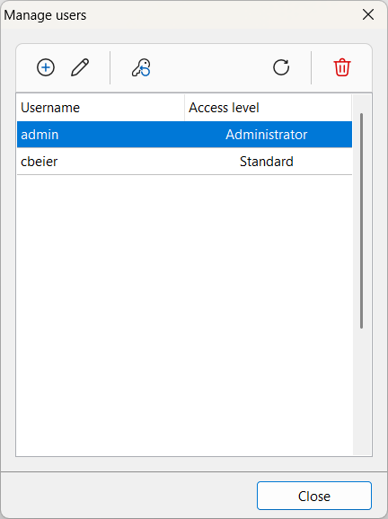

# Users

A **user** is anyone who connects to and interacts with a Xolmis database file. Each database connection has its own set of users, independent from other databases. To open a Xolmis connection, you must log in with a **username** and **password**. Every action performed in the system is recorded with the username, ensuring **security, accountability, and change tracking**.

## User management dialog

To manage database users, open the dialog via the main menu: **File → Manage users**. This dialog displays a list of users registered in the current database file, along with a toolbar at the top for management actions.

| Icon | Button | Function |
| --- | --- | --- |
| :material-plus-circle: | **Add** | Create a new user in the current database |
| :material-pencil: | **Edit** | Edit the information and permissions of the selected user |
| :fontawesome-solid-key: | **Change password** | Change the password of the selected user |
| :material-refresh: | **Refresh** | Reload the user list |
| :material-delete: | **Delete** | Delete the selected user |

## Adding and editing users

To add a new user, click the **Add** button :material-plus-circle:. To edit an existing user, click the **Edit** button :material-pencil: or double-click the user in the list. This opens the **Edit user dialog**:

| Field | Required | Description |
| --- | --- | --- |
| **Username** | Yes | Login name used to access the database and displayed in change logs |
| **Fullname** |  | Optional real name of the user |
| **Access level** | Yes | Defines privileges or restrictions (see below) |
| **Manage collection** |  | Grants permission to edit collection data |
| **Print reports** |  | Grants permission to generate, print, or export reports |
| **Export data** |  | Grants permission to export data |
| **Import data** |  | Grants permission to import data |

### Access levels

Access levels define the scope of permissions available to each user:

| Level | Description |
| --- | --- |
| **Administrator** | Highest privileges, full access to all functionalities. Intended for database maintenance and critical tasks. **Not recommended** for everyday data editing. |
| **Standard** | Default level. Grants access to almost all functionalities. Recommended for daily use and data editing. |
| **Visitor** | Restricted access. Can only view data, without editing permissions. Useful for external collaborators or audits. |

!!! note "`admin` user"
    The `admin` user is automatically created when a new database file is initialized. It must **not** be used for trivial tasks like editing data, but reserved for administrative and maintenance operations.

## Changing a user password

To change a password, click the **Change password** button :fontawesome-solid-key:. The system will prompt for authentication using the current password of the selected user. Once authenticated, the **Change password dialog** opens:

Enter the new password and confirm it. Click **Save** to apply the change.

!!! note
    If you attempt to change the password of another user (not the one currently logged in), authentication with that user’s current password is required.

## Deleting a user

To delete a user, click the **Delete** button :material-delete:. The system will prompt for confirmation. Click **Yes** to proceed.

!!! warning
    If the user has already performed editing tasks, it is **not recommended** to delete them. Deleting a user may result in losing traceability of changes in the record history.

!!! info
    The `admin` user cannot be deleted.

## Best practices

- **Assign appropriate access levels**: Use Administrator only for maintenance, Standard for daily work, and Visitor for read-only access.  
- **Avoid deleting active users**: Instead, disable or restrict permissions to preserve history logs.  
- **Use meaningful usernames**: Choose usernames that clearly identify the person or role.  
- **Document permissions**: Keep track of which users have rights to import/export data for accountability.  
- **Change passwords regularly**: Encourage users to update their passwords to maintain security.  
- **Reserve `admin` for emergencies**: Use the default admin account only when necessary, not for routine tasks.  

## Relation to other modules

User management is interconnected with other parts of Xolmis:

- **[Record history](record-history.md)** – Every change is logged with the username of the editor.  
- **[Imports](importing-data.md)/[exports](exporting-data.md)** – Permissions control who can transfer data in and out of the system.  

By managing users effectively, Xolmis ensures **data integrity, accountability, and secure collaboration** across research teams.
